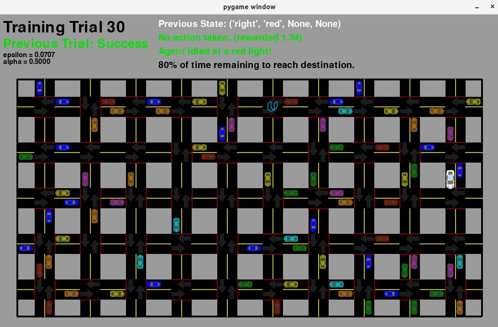
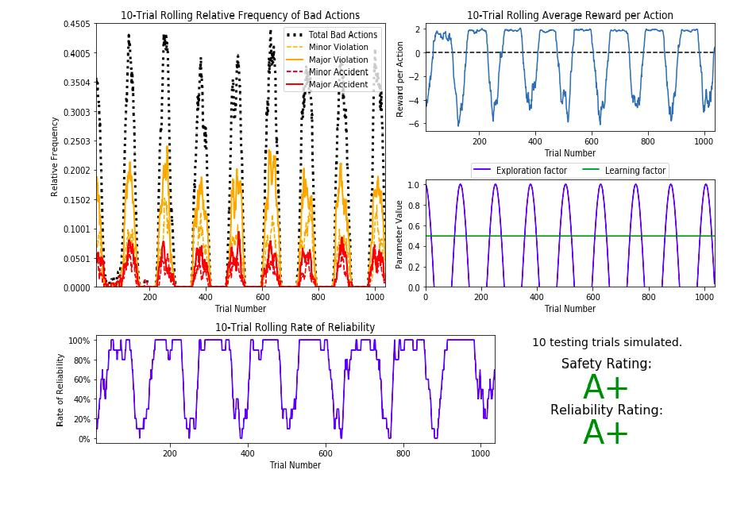
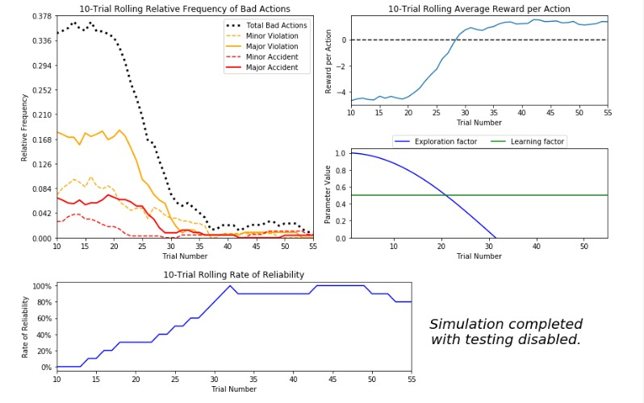

SMART-CAB

Mainly Its Also Called as Driver less Cabs,or Data Driven Cabs..
Its an Mini Project ,Naming as Smart Cab its Basically an web application done through an real time Database with Machine Learning ,Q learning Algorithm..
and its Done as 6th sem Project so that its under the guidence of DR.Siddesh.G.M so  that we are thankfull to sir.

We got An Certificated from MSRIT

RAMAIAH INSTITUTE OF TECHNOLOGY
(Autonomous Institute Affiliated to VTU)
M. S. Ramaiah Nagar, M. S. R. I. T. Post, Bangalore – 560054

DEPARTMENT OF INFORMATION SCIENCE AND ENGINEERING

 RAMAIAH
  Institute of Technology

CERTIFICATE

This is to certify that the project work entitled “Smart Cab” is a bonafide work carried out by Anmol Kapoor , Kumar Hegde, Pranav Hegde bearing      
USN: 1MS17IS026,1MS18IS406,1MS18IS412 in partial fulfillment of requirements of Mini-Project (ISL64) of Sixth Semester B.E. It is certified that all corrections/suggestions indicated for internal assessment has been incorporated in the report. The project has been approved as it satisfies the academic requirements in respect of project work prescribed by the above said course.

_________________________            					              _________________________              
Signature of the Guide               					Signature of the HOD                   
Dr.Siddesh.G					                                         Dr. Vijaya Kumar B P                
Associate Professor                            					Professor and Head,                   Dept. of ISE, RIT,                  	     					Dept. of ISE, RIT                           Bangalore-54             							Bangalore-54                                     

Other Examiners
Name of the Examiners:	                                                                   Signature
1. 
2.

VIDEOS LINK:
## https://www.youtube.com/embed/ev2Krxe3gyg

OUTPUT1:
## Simulation

OUTPUT2:

OUTPUT3:

